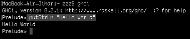
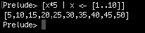

# Haskell
Haskell adalah bahasa pemrograman purely-functional atau dikenal dengan bahasa pemrograman funsional murni, Haskell muncul pada tahun 1990 yang dirancang oleh `Simon Peyton Jones, DKK`, yang mengikuti paradigma `functional, lazy/non-strict, dan modular`.

# Cara install haskell
1. Untuk Sistem Operasi Windows
    Untuk mengintall haskell-platform pada sistem operasi windows anda silahkan kunjungi link berikut:
    `https://www.haskell.org/platform/windows.html`.
2. Untuk Sistem Opeasi Linux
     Untuk mengintall haskell-platform pada sistem operasi linuxg anda silahkan kunjungi link berikut:
    `https://www.haskell.org/platform/mac.html#linux`
3. Untuk Sistem Operasi OS X
     Untuk mengintall haskell-platform pada sistem operasi OS X anda silahkan kunjungi link berikut:
    `https://www.haskell.org/platform/mac.html`

# Editor
1. Atom
2. Visual Studio Code
3. Sublime, atau
4. Editor lainya.

# Test instalasi
Jika instalasi sudah berhasil maka lakukan ujicoba pada terminal, silahkan ketik `ghci` pada terminal anda dan pastikan muncul seperti pada gambar dibawah ini:


# Menjalankan Program dengan menggunakan GHC.
1. Buat file haskell dengan format `step1.hs`, dan berikut adalah contoh programanya :
    ```haskell
    main = do
    let var1 = 2
    let var2 = 3
    putStrLn "Pada tahap ini saya sedang belajar haskell:"
    print(var1 + var2)
    ```
    untuk menjalankan file tersebut gunakan perintah `ghc -o step1 step1.hs && ./step1`


## Demo Program
### Hello World



### Operasi Perkalian

