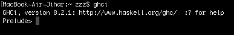

# Haskell
Haskell adalah bahasa pemrograman purely-functional atau dikenal dengan bahasa pemrograman funsional murni, Haskell muncul pada tahun 1990 yang dirancang oleh `Simon Peyton Jones, DKK`, yang mengikuti paradigma `functional, lazy/non-strict, dan modular`.

# Cara install haskell
1. Untuk Sistem Operasi Windows
    Untuk mengintall haskell-platform pada sistem opeasi windows anda silahkan kunjungi link berikut:
    `https://www.haskell.org/platform/windows.html`.
2. Untuk Sistem Opeasi Linux
     Untuk mengintall haskell-platform pada sistem opeasi linuxg anda silahkan kunjungi link berikut:
    `https://www.haskell.org/platform/mac.html#linux`
3. Untuk Sistem Operasi OS X
     Untuk mengintall haskell-platform pada sistem opeasi OS X anda silahkan kunjungi link berikut:
    `https://www.haskell.org/platform/mac.html`

# Editor
1. Atom
2. Visual Studio Code
3. Sublime, atau
4. Editor lainya.

# Contoh
1. Jika instalasi sudah berhasil maka lakukan ujicoba pada terminal, silahkan ketik `ghci` pada terminal anda dan pastikan muncul seperti pada gambar dibawah ini:
